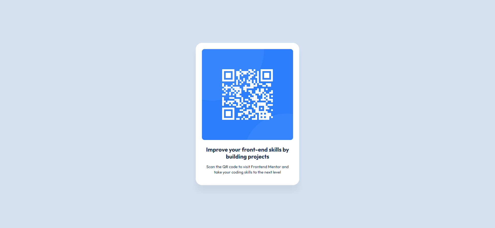

# Frontend Mentor - QR code component solution

This is a solution to the [QR code component challenge on Frontend Mentor](https://www.frontendmentor.io/challenges/qr-code-component-iux_sIO_H). Frontend Mentor challenges help you improve your coding skills by building realistic projects.

## Table of contents

- [Overview](#overview)
  - [Screenshot](#screenshot)
  - [Links](#links)
- [My process](#my-process)
  - [Built with](#built-with)
  - [What I learned](#what-i-learned)
  - [Continued development](#continued-development)
- [Author](#author)

## Overview

### Screenshot



### Links

- Solution URL: [https://imgur.com/NFBHurY](https://github.com/david-franca/qr-code-component)
- Live Site URL: [https://qr-code-component-lake-seven.vercel.app](https://qr-code-component-lake-seven.vercel.app/)

## My process

### Built with

- Semantic HTML5 markup
- CSS custom properties
- Flexbox
- Mobile-first workflow
- [React](https://reactjs.org/) - JS library
- [Next.js](https://nextjs.org/) - React framework
- [Chakra UI](https://v2.chakra-ui.com/) - For a component library

### What I learned

How to change a favicon in a Next.JS project using a .png image with 32x32.

Create a public folder in the root of project and a img folder. Put inside your file and rename it to "favicon" for a better semantic.

Then add this block of code and insert in the layout.tsx inside of html tag.

```html
<html>
  <link rel="icon" href="/img/favicon.png" type="image/png" sizes="32x32" />
  ...
</html>
```

### Continued development

I need to continue focusing in improve performance in a application and semantic html tag. Other thing is to learn about testing and validations.

## Author

- Website - [David França](https://davidfranca.vercel.app/)
- Frontend Mentor - [@david-franca](https://www.frontendmentor.io/profile/david-franca)
